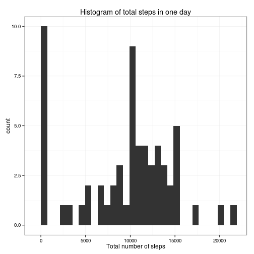
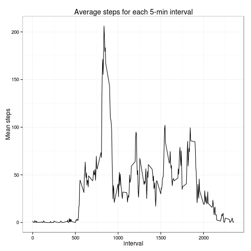
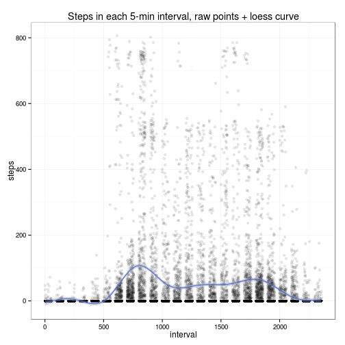
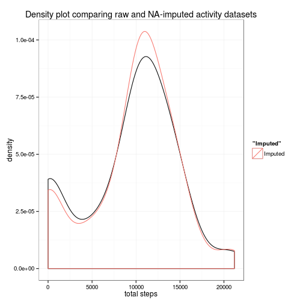
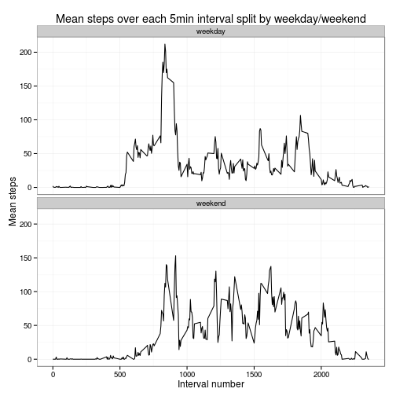

```r
#Header code, setup required libraries
library(ggplot2)
library(plyr)
```

## Loading and preprocessing the data

```r
#read in
activity<-read.csv("activity.csv",colClasses=c("integer","Date","integer"))
#q1
stepsperday<-ddply(activity, c("date"),summarise,
                   totalsteps=sum(steps,na.rm=TRUE)
                   )
#q2
stepsper5min<-ddply(activity, c("interval"),summarise,
                    meansteps = mean(steps,na.rm=TRUE)
                    )
```

## What is mean total number of steps taken per day?

The mean total number of steps taken per day is 9354.2295.  The median number of steps taken per day is 10395(NA's omitted).


```r
stepshist<-ggplot(stepsperday,aes(x=totalsteps))+geom_histogram()+
  xlab("Total number of steps")+
  ggtitle("Histogram of total steps in one day")+
  theme_bw()
print(stepshist)
```

```
## stat_bin: binwidth defaulted to range/30. Use 'binwidth = x' to adjust this.
```

 

## What is the average daily activity pattern?

```r
dayline<-ggplot(stepsper5min,aes(x=interval,y=meansteps))+geom_line()+
  ggtitle("Average steps for each 5-min interval")+
  ylab("Mean steps")+
  theme_bw()
print(dayline)
```

 

Alternative daily activity pattern visualisation, raw points with a loess curve


```r
dayraw<-ggplot(activity,aes(x=interval,y=steps))+geom_point(alpha=.1)+geom_smooth()+
  ggtitle("Steps in each 5-min interval, raw points + loess curve")+
  theme_bw()
print(dayraw)
```

```
## geom_smooth: method="auto" and size of largest group is >=1000, so using gam with formula: y ~ s(x, bs = "cs"). Use 'method = x' to change the smoothing method.
```

```
## Warning: Removed 2304 rows containing missing values (stat_smooth).
## Warning: Removed 2304 rows containing missing values (geom_point).
```

 

The five minute interval with the highest mean step-count is interval #835 with a mean of 206.1698 steps.  

## Imputing missing values

There are 2304 incomplete records, unevenly distributed through the data.


```r
hist(which(complete.cases(activity)),
     main="Count of complete cases (chronological order)",
     xlab="Observation number",
     ylab="Count of complete cases"
     )
```

 
 
Interpolation is done by using the average of the previous valid observation and the next valid observation, or the average for the relevant 5-min interval if there is no valid previous/next observation. This produces smooth activity-over-the-day lines for each individual day, but is not very fast.
 

```r
#q3
step_interpolation <- function(rownumber){
  prevrow=rownumber;
  nextrow=rownumber;
  while(is.na(activity$steps[prevrow])){
    prevrow=prevrow-1
    if(prevrow<1)return(mean(activity[activity$interval==activity$interval[rownumber],"steps"],na.rm=TRUE))
  }
  while(is.na(activity$steps[nextrow])){
    nextrow=nextrow+1
    if(nextrow>nrow(activity))return(mean(activity[activity$interval==activity$interval[rownumber],"steps"],na.rm=TRUE))
  }
  return(
    (activity$steps[prevrow]+activity$steps[nextrow])/2
  )
}

activity_guessNA <-activity
for(n in 1:nrow(activity)){
  if(is.na(activity$steps[n])){
    activity_guessNA$steps[n]=step_interpolation(n);
  }
}
```

I know, this is a density plot not a histogram, but the meaning is the same and I didn't want to superimpose two histograms. The imputed dataset has (relatively) fewer zeros, the original data is peppered with lone zeros and the imputation strategy above just doesn't reproduce this pattern. Most of the imputed entries appear to have been added in the most commonly occuring range.


```r
stepsperday2<-merge(
  ddply(activity_guessNA, c("date"),summarise,
        guesstotalsteps=sum(steps,na.rm=TRUE)
  ),
  stepsperday,
  by="date"
)

guesscheck<-ggplot(stepsperday2,aes(x=totalsteps))+
  geom_density()+
  geom_density(aes(x=guesstotalsteps,color="Imputed"))+
  ggtitle("Density plot comparing raw and NA-imputed activity datasets")+
  xlab("total steps")+
  theme_bw()
print(guesscheck)
```

 

The mean and median total steps are 9354.2295 and 10395, for the NA-imputed data the mean and median are  9707.2193 and 1.0571 &times; 10<sup>4</sup>.

## Are there differences in activity patterns between weekdays and weekends?

Looks like activity is higher on the weekends, particularly in the middle of the day, although it is lower early in the morning just after wakeing.


```r
paindays= c("Monday","Tuesday","Wednesday","Thursday","Friday")

activity_guessNA$weekday<-as.factor(ifelse(weekdays(activity_guessNA$date)%in%paindays,"weekday","weekend"))

stepsperinterval.weekdaysplit<-ddply(activity_guessNA, c("interval","weekday"),summarise,
                    meansteps = mean(steps,na.rm=TRUE)
)

weekdayplot<-ggplot(stepsperinterval.weekdaysplit,aes(x=interval,y=meansteps,color=weekday))+
  geom_line()+
  theme_bw()+
  ggtitle("Mean steps over each 5min interval split by weekday/weekend")+
  ylab("Mean steps")+
  xlab("Interval number")
print(weekdayplot)
```

 

